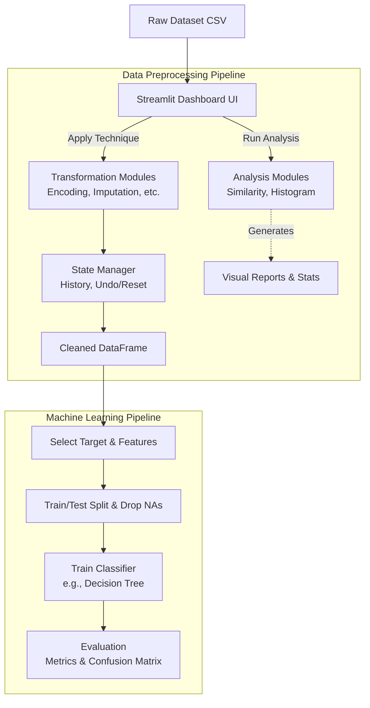

# ML Dashboard

A comprehensive data preprocessing and machine learning dashboard built with Python and Streamlit. Developed for a Data Mining course, this project provides a unified, interactive environment to apply data engineering techniques, visualize transformations in real-time, and seamlessly train and evaluate Machine Learning classification models.

---

## Architecture & Data Flow

The project is built on a modular, dual-pipeline architecture separating data engineering (preprocessing) from data science (model training).



### Key Technical Details

- **Separation of Concerns:** The core Streamlit application (`app.py`) is completely decoupled from the analytical logic. Two orchestrators (`pipeline.py` and `ml_pipeline.py`) handle all state management, routing, and validation.
- **Plug-and-Play Module System:** Algorithms are implemented as independent, duck-typed classes. They are wired into the UI dynamically via a central `registry.py`, requiring zero modifications to the frontend code when introducing new techniques.
- **Immutable Data Handling:** Transformations operate strictly on copies of the data. This allows the `PreprocessingPipeline` to maintain a robust history log, enabling "Undo" functionality and rendering exact Before/After tabular comparisons.
- **Safe ML Handoff:** The `MLPipeline` inherits the cleaned data snapshot from the preprocessing stage, automatically handles feature selection edge cases (such as isolating local NaNs during train/test splits), and leverages Scikit-Learn alongside Plotly for rich evaluation metrics.

---

## Project Structure

```
ML-Dashboard/
├── app.py                          # Main Streamlit dashboard UI
├── pipeline.py                     # Central preprocessing orchestrator (Data Engineering)
├── ml_pipeline.py                  # Central machine learning orchestrator (Model Training)
├── registry.py                     # Central registry mapping modules to the pipelines
├── requirements.txt                # Python dependencies
├── datasets/
│   └── titanic.csv                 # Default sample dataset
└── modules/                        # Preprocessing and ML Modules
    ├── discretization/
    ├── missing_values/
    ├── smoothing/
    ├── data_reduction/
    ├── encoding/
    ├── histogram_disc/
    ├── similarity/
    └── ClassifierModels/
        └── DecisionTree.py
```

---

## Running Locally

**Prerequisites:** Python 3.10 or higher.

1. **Set up a virtual environment:**

   ```powershell
   py -3.14 -m venv .venv
   .venv\Scripts\activate
   ```

   *(Note: Adjust the python command depending on your OS and installed version, e.g., `python3 -m venv .venv`)*

2. **Install dependencies:**

   ```powershell
   pip install -r requirements.txt
   ```

3. **Launch the dashboard:**

   ```powershell
   streamlit run app.py
   ```

   This will start the local server and automatically open the interactive dashboard in your default web browser (typically at `http://localhost:8501`).

